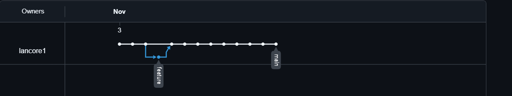

# Empty-rep 

## Короткий опис проекту

Цей проєкт демонструє базову роботу з Git та GitHub: 
створення локального та віддаленого репозиторіїв, робота з гілками, коміти та merge.
Також проект показує організацію структури проєкту та налаштування SSH-зв’язку.

## Мета
- Освоїти базові команди Git (commit, push, pull, branch, merge).  
- Навчитись створювати та управляти гілками.  
- Ознайомитись з публічними репозиторіями на GitHub та налаштуванням SSH.

## Функціонал
- Створення та редагування файлів у локальному репозиторії.  
- Відправка змін на GitHub через SSH.  
- Створення нових гілок(feature) та їх об’єднання (merge) з `main`.  
- Ведення історії комітів з описовими повідомленнями.

# Інструкція запуску

## Швидкий початок (для автора / співавтора)

1. Клонуйте репозиторій на локальний комп’ютер за SSH ключем:
``` bash
git@github.com:lancore1/empty-rep.git
```
2. Перейдіть у папку проєкту: 
cd empty-rep
3. Перевірте наявність всіх гілок та актуалізуйте main: 
git checkout main
git pull origin main
4. Створіть нову гілку для фічі/вправи:
git checkout -b feature/add-test-file
4. Вносьте зміни, додавайте файли та робіть коміти:
git add .
git commit -m "опис змін"
5. Відправляйте зміни на GitHub:
git push origin feature/add-test-file
6. На GitHub створіть Pull Request з feature/add-test-file в main.
Перевірте зміни і виконайте Merge (через сайт) або якщо маєте права - зробіть squash/merge.
7. Поверніться на main і підтягніть оновлення:  

## Якщо ви не маєте прав запису (інший користувач)

1. На сторінці репозиторію натисніть Fork (створиться копія у вашому профілі).
2. Клонуйте ваш fork:
git clone git@github.com:<ваш_логін>/empty-rep.git
cd empty-rep
3. Cтворіть гілку, зробіть зміни, запуште
git checkout -b feature/my-change
git add .
git commit -m "my change — короткий опис"
git push origin feature/my-change
4. На GitHub із вашого форка створіть Pull Request до lancore1/empty-rep 
(feature/my-change в main).
5. Автор/власник репозиторію переглядає PR і вирішує — мерджити чи ні.

## Призначення репозиторію

Репозиторій створено для практики організації структури проєкту, 
налаштування SSH-зв’язку, роботи з комітами та гілками(створення, та перемикання між ними), 
а також для демонстрації базових навичок роботи з Git та GitHub.




## Автор

Кравець Валерій П-32

## Контакти 

Email: kravastok13345@gmail.com
GitHub:https://github.com/lancore1